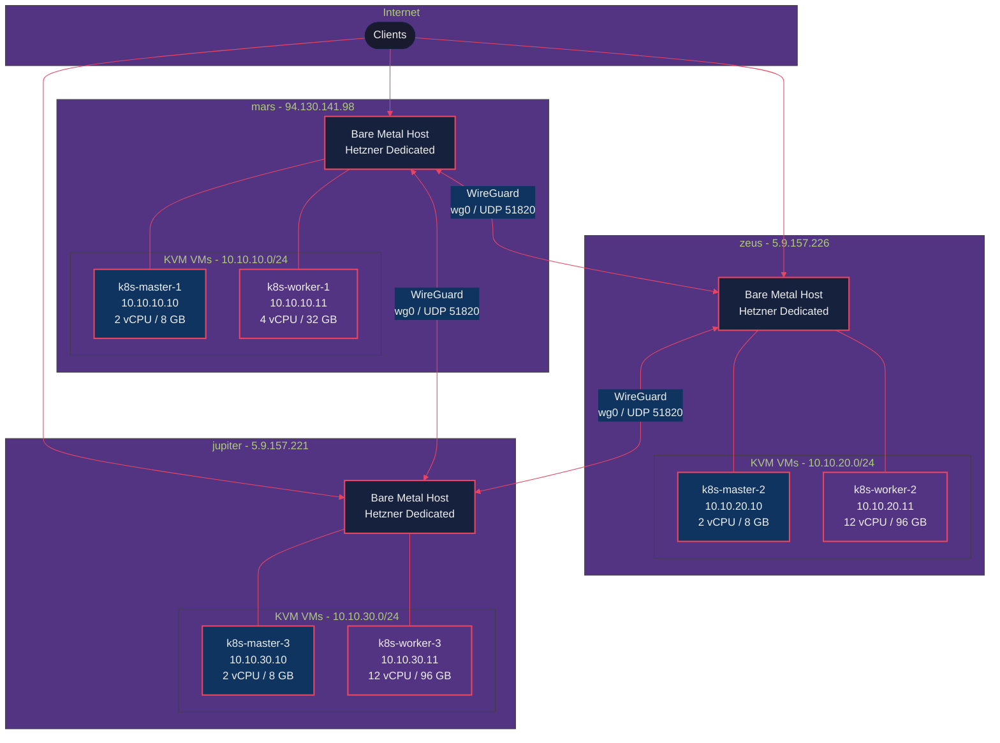
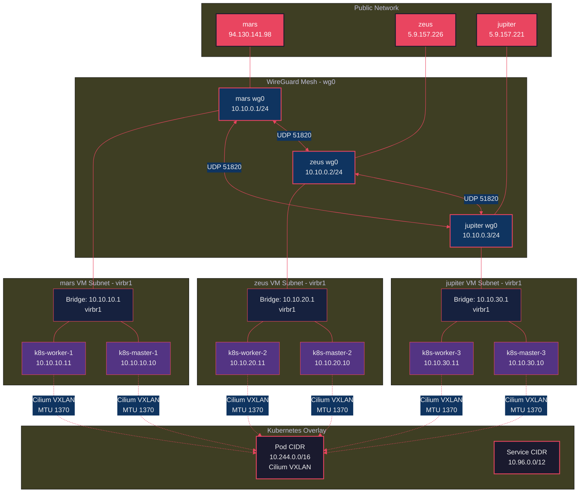
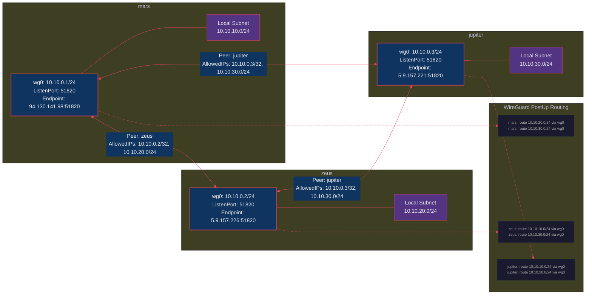
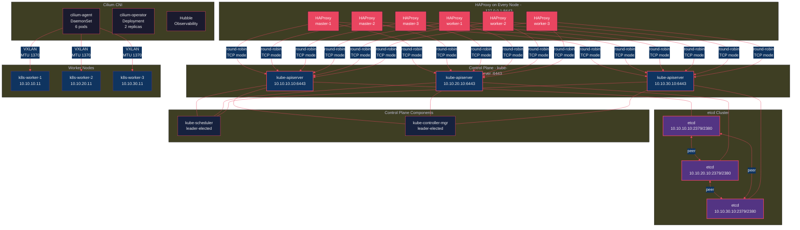
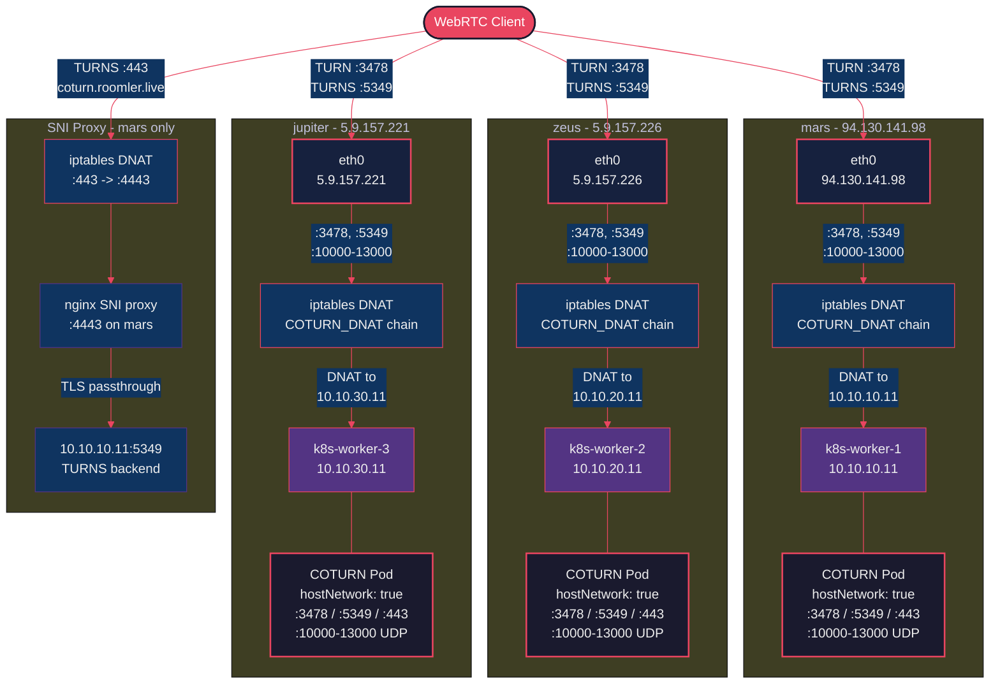
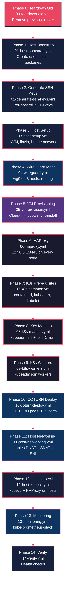
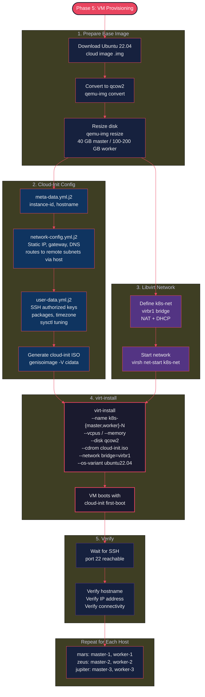
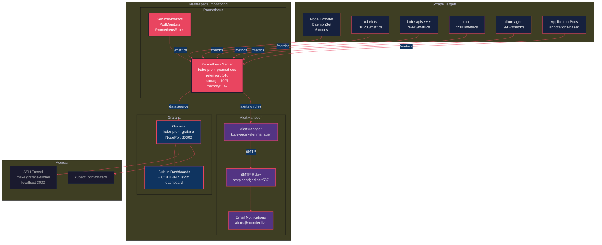

# From One Box to Three: Building a Multi-Host HA Kubernetes Cluster That Refuses to Die

*A guide on evolving from a single-server K8s setup to a 3-host, 6-VM, WireGuard-meshed, Cilium-powered, battle-hardened cluster — with COTURN on every host, because WebRTC users deserve nice things.*

---

So, remember that blog post where I crammed an entire Kubernetes cluster into one Hetzner box? Three VMs, one master, two workers, COTURN, the works? It was beautiful. It ran like a charm. My apps were humming. My dashboards were green.

And then I thought: "What happens when mars goes down?"

*Silence.*

That single Hetzner box — affectionately named `mars` — was a single point of failure. If it sneezed, everything sneezed with it. The master node, the workers, COTURN, the whole circus. One kernel panic, one disk failure, one Hetzner maintenance window, and my users would be staring at a loading spinner.

So I did what any reasonable person with a taste for self-inflicted complexity would do: I got two more servers. Named them `zeus` and `jupiter`. Because if you're going to over-engineer something, at least give the servers cool names.

Spoiler alert: it was totally worth it. Again.

---

## The Upgrade: What Changed

Let me lay it out. The old setup vs. the new one:

| | **Old (single-host)** | **New (multi-host HA)** |
|---|---|---|
| **Servers** | 1 (mars) | 3 (mars, zeus, jupiter) |
| **VMs** | 3 (1 master + 2 workers) | 6 (3 masters + 3 workers) |
| **Control plane** | Single master (SPOF) | HA with 3 masters + etcd quorum |
| **Networking** | Single NAT bridge | WireGuard mesh + 3 NAT bridges |
| **COTURN** | 2 pods (1 host, 2 public IPs) | 3 pods (3 hosts, 3 public IPs) |
| **Failover** | None. Pray. | Automatic. etcd quorum, HAProxy LB |
| **Total resources** | 10 vCPU, 20 GB RAM | 34 vCPU, 248 GB RAM |

The old cluster was a studio apartment. The new one is a three-bedroom house with a panic room.

---

## Part 1: The Architecture

Three Hetzner dedicated servers, spread across their Frankfurt datacenter. Each runs KVM with two VMs — one master, one worker. Connected by a WireGuard mesh that makes them think they're neighbors.



Three hosts. Six VMs. One cluster. Zero single points of failure. Well, except for my own sanity — that had exactly one replica with no failover.

### The Network Layer Cake

Here's where it gets fun. We have *four* layers of networking, stacked like a particularly ambitious lasagna:



From top to bottom:

1. **Public IPs** — how the internet sees us (3 Hetzner IPs)
2. **WireGuard mesh** — how the hosts see each other (encrypted tunnel, `10.10.0.0/24`)
3. **VM subnets** — how VMs talk within their host (`10.10.{10,20,30}.0/24`)
4. **K8s overlay** — how pods talk to each other (Cilium VXLAN, `10.244.0.0/16`)

The MTU math is important here: Ethernet 1500 → WireGuard overhead → 1420 → VXLAN overhead → **1370**. Get this wrong and you'll spend three days debugging why large packets silently disappear. Ask me how I know.

---

## Part 2: WireGuard — The Glue That Holds It Together

The fundamental challenge of a multi-host cluster is: *how do VMs on different physical servers talk to each other?* Your master on mars needs to gossip with the master on jupiter. Your pods need to float freely across all six VMs.

Enter WireGuard. It's a VPN. It's fast. It's simple. It's built into the Linux kernel. And it turns three servers in the same datacenter into what feels like one big happy network.



Each host peers with the other two (full mesh). The `AllowedIPs` include both the WireGuard IP *and* the remote VM subnet — so mars can route to `10.10.20.0/24` (zeus's VMs) and `10.10.30.0/24` (jupiter's VMs) through the tunnel.

The PostUp scripts handle the routing magic:

```bash
# mars PostUp adds:
ip route add 10.10.20.0/24 via 10.10.0.2 dev wg0   # route to zeus VMs
ip route add 10.10.30.0/24 via 10.10.0.3 dev wg0   # route to jupiter VMs
```

There's also an anti-masquerade dance with iptables to preserve source IPs across the mesh. libvirt helpfully adds MASQUERADE rules to NAT traffic from VMs to the outside — great for internet access, terrible for cross-host VM communication. The fix: mark WireGuard-bound packets and skip masquerading for them.

---

## Part 3: HA Control Plane — No More Single Points of Failure

The old setup had one master. One API server. One etcd. If it went down, `kubectl` became a very fancy error generator.

The new setup? Three masters, three etcd members, and — here's the punchline — **HAProxy on every single node**.



**Why HAProxy on every node?** Because every kubelet needs to talk to the API server. If we pointed them all at one master, we're back to SPOF territory. Instead, every VM runs HAProxy on `127.0.0.1:8443`, round-robining across all three API servers. Kubelet talks to localhost, HAProxy handles the rest.

If one master dies, the other two keep serving. etcd maintains quorum (2 out of 3). kube-scheduler and kube-controller-manager have leader election built in. The cluster barely notices.

**The kubeadm bootstrap dance** is carefully choreographed:

1. **master-1**: `kubeadm init` with `--control-plane-endpoint=127.0.0.1:8443`
2. Install Cilium (with `operator.replicas=1` — only one schedulable node!)
3. **master-2 & master-3**: `kubeadm join` with `--control-plane` flag
4. Scale Cilium operator to 2 replicas
5. **worker-1, 2, 3**: Regular `kubeadm join`

The critical detail: `skipPhases: addon/kube-proxy` in the kubeadm config. Cilium replaces kube-proxy entirely. Installing both is asking for a networking fight that nobody wins.

---

## Part 4: COTURN — Now With Triple Redundancy

In the old setup, we had two COTURN pods sharing two public IPs on one host. Cute, but if that host went down, every WebRTC user behind a NAT would be staring at a black screen.

Now we have **three COTURN instances, one per host**, each with its own public IP and its own iptables forwarding chain:



Each host has its own `COTURN_DNAT` iptables chain that forwards TURN traffic (3478, 5349, 10000-13000) from the host's public IP to the worker VM. Each COTURN pod runs with `hostNetwork: true` and knows its own public/private IP mapping via the `external-ip` config.

The beautiful part: lose a host, lose one COTURN instance. The other two keep relaying. Your WebRTC users don't even notice.

**The SNAT gotcha:** When COTURN on worker-1 relays media to a client that came in through zeus's IP, the relay packet must be SNAT'd to the correct public IP. Without per-host SNAT rules for relay port ranges, clients silently drop packets because the source IP doesn't match. This one was a beautiful 4-hour debugging session.

---

## Part 5: The 15-Phase Deployment Pipeline

The entire cluster bootstraps from zero through 15 Ansible phases. It's like a recipe, except instead of ending with a cake, you end up with a production-grade Kubernetes cluster.



Running it is almost anticlimactic:

```bash
git clone https://github.com/your-user/k8s-cluster-multi.git
cd k8s-cluster-multi
cp .env.example .env && vi .env    # add your secrets
make setup                          # go make a sandwich
make verify                         # confirm everything works
```

The `make verify` script runs 9 categories of health checks: VM connectivity, WireGuard mesh, cross-host routing, K8s node status, Cilium health, COTURN relay testing, iptables rules, monitoring stack, and DNS resolution.

### VM Provisioning Pipeline

Each VM goes through a 5-step pipeline — from cloud image to fully configured K8s-ready node:



Cloud-init handles the first-boot configuration: hostname, static IP, SSH keys, packages, and sysctl tuning. No clicking through installers. Boot the VM, it's ready.

---

## Part 6: Monitoring — Dashboard Therapy

We deploy the full **kube-prometheus-stack** via Helm. Because running a 6-node cluster without monitoring is like driving at night with the headlights off.



Fourteen days of metric retention, email alerts via SendGrid, and a custom COTURN dashboard that shows relay allocations, bandwidth, and error rates. It's oddly soothing to watch those graphs. Dashboard therapy, I call it.

---

## What's Actually Running on This Thing?

With a 6-node cluster and 248 GB of RAM, we're not just running COTURN. Here's the current tenant list:

| App | Stack | Worker | Domain |
|-----|-------|--------|--------|
| **App 1** | Rust (Axum) + Vue 3 + mediasoup WebRTC | worker-3 | app1.example.com |
| **App 2** | Bun/Elysia.js + Vue 3 | worker-1 | app2.example.com |
| **App 3** | Bun/Elysia.js + Vue 3 (8 microservices) | worker-2 | app3.example.com |
| **App 4** | Rust (Axum) + Vue 3 + ClickHouse | worker-2 | app4.example.com |
| **App 5** | 3 legacy apps + Redroid (Android in K8s!) | worker-3 | various |

Twelve namespaces, running everything from a Rust WebRTC SFU to literal Android containers in Kubernetes.

---

## Lessons Learned (The Hard Way, Part 2)

Because apparently I didn't learn enough painful lessons the first time:

**1. containerd's `sandbox_image` will ruin your weekend.** K8s 1.31 expects pause:3.10. containerd defaults to pause:3.8. This mismatch causes a pod sandbox recreation storm with random CrashLoopBackOffs. The fix: regenerate the full containerd config and patch it.

**2. Cilium operator replicas during bootstrap.** Only one schedulable node during `kubeadm init`. Start with `operator.replicas=1`, scale to 2 after workers join.

**3. WireGuard + libvirt masquerading is a trap.** libvirt's NAT masquerade rewrites source IPs on cross-host traffic, breaking etcd peers and Cilium health checks. Anti-masquerade iptables rules are essential.

**4. Network interface names aren't universal.** mars uses `eth0`, zeus and jupiter use `enp5s0`. Different Hetzner generations, different names. Parametrize everything.

**5. Docker restarts flush your iptables.** A systemd service + Docker event hook that re-applies COTURN rules. Belt and suspenders.

**6. COTURN SNAT + cross-host relay is non-obvious.** Per-host SNAT rules for relay port ranges. Without them, clients silently drop packets from unexpected source IPs.

**7. Libvirt and WireGuard race on iptables after reboot.** When the host reboots, WireGuard inserts iptables rules first. Then libvirt starts and pushes its chains above WireGuard's, blocking cross-host VM traffic and masquerading source IPs (breaking etcd TLS). Fix: a `wg-fix-iptables.service` systemd oneshot that re-applies idempotent PostUp rules *after* libvirt starts.

**8. `libvirt-guests` will pause your VMs.** Default `ON_SHUTDOWN=suspend` saves VM state to disk; restore often leaves VMs `paused`. Fix: `ON_BOOT=ignore` + `ON_SHUTDOWN=shutdown` + `virsh autostart`.

**9. Docker images accumulate fast.** 70GB of dangling images + 36GB of build cache on one host. Fix: weekly cron cleanup (keep last 3 tags per repo) + kubelet image GC thresholds lowered to 70%/60%.

---

## Host Reboot Resilience

After all these fixes, the cluster survives bare-metal host reboots with zero manual intervention:

```
Host reboots → WireGuard starts → libvirtd starts (re-creates iptables)
→ VMs auto-start → wg-fix-iptables.service fixes iptables ordering
→ K8s nodes rejoin → pods reschedule → cluster healthy
```

Verified by sequentially rebooting both zeus and jupiter: 6/6 nodes Ready, 69/69 pods healthy, zero manual intervention both times.

---

## What's Next?

The cluster is stable, running five production apps, and I've only been woken up once by an alert (false alarm — Prometheus was just being dramatic).

On the roadmap:
- **Automated backups** — scheduled MongoDB dumps to S3/MinIO
- **GitOps** — ArgoCD for declarative deployments
- **Autoscaling** — HPA for the apps that need it

---

## Try It Yourself

The entire infrastructure is open source:

- **Multi-host HA cluster:** (this repo)
- **Original single-host setup:** (see companion single-host repo)

Star the repos if this was useful, open an issue if something's broken, and if you successfully build your own multi-host cluster after reading this — drop me a line. I'll raise a coffee to your success. Actually, make it a beer. You'll have earned it.

Cheers!
