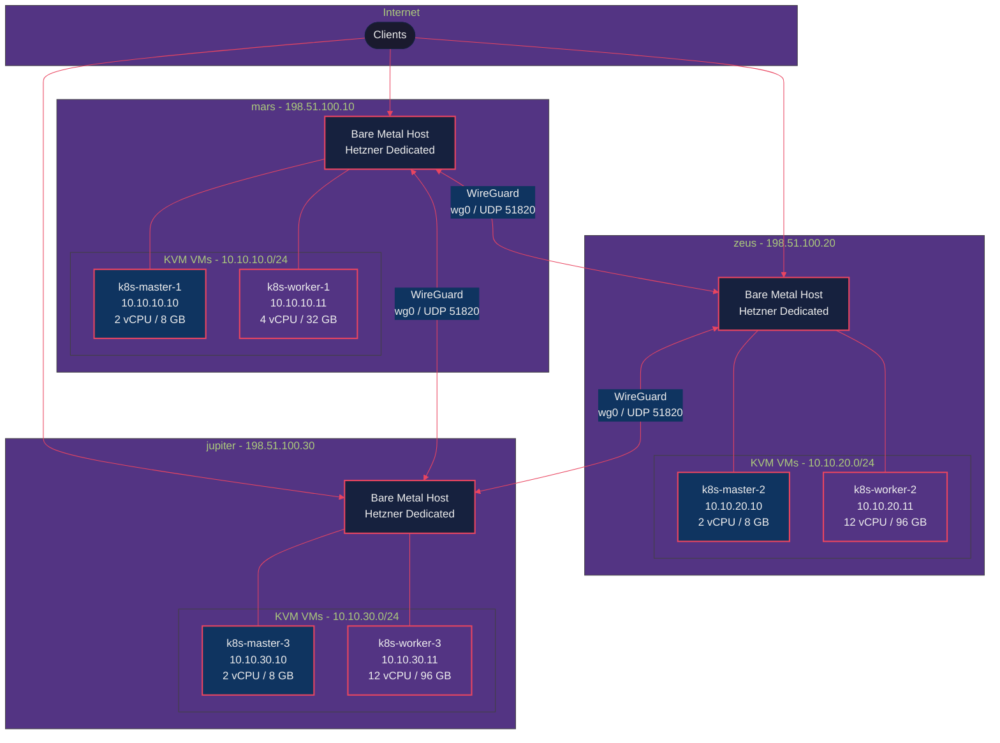
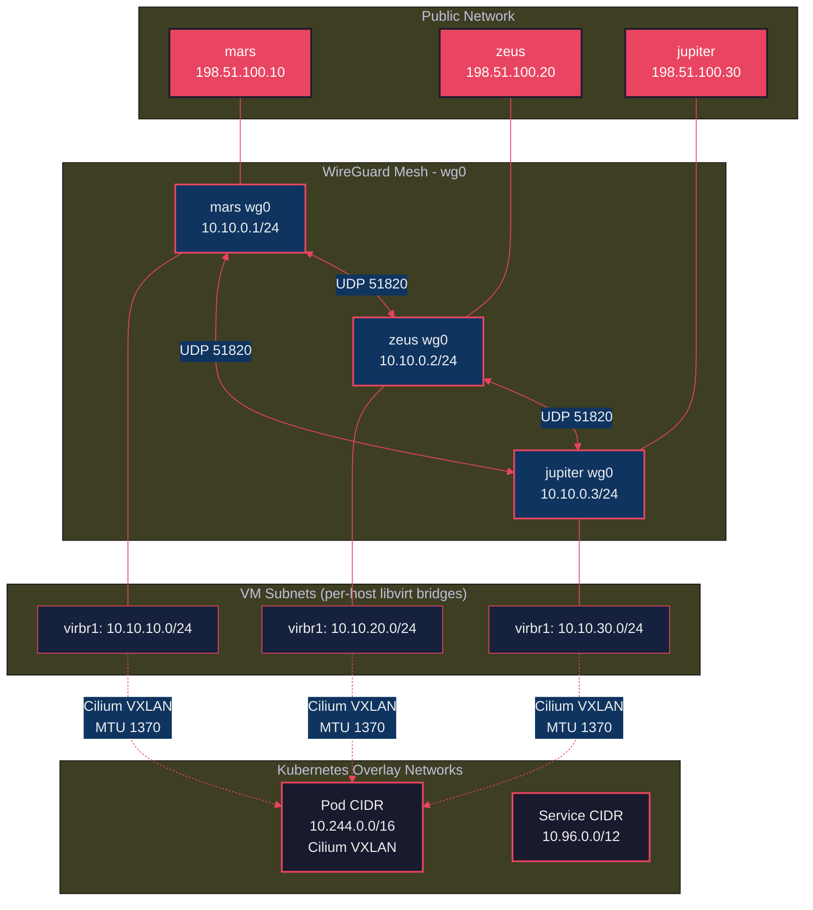
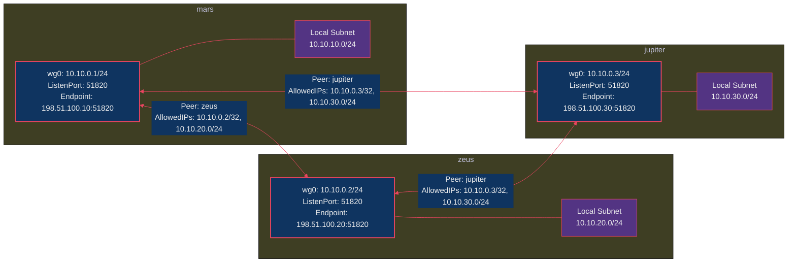
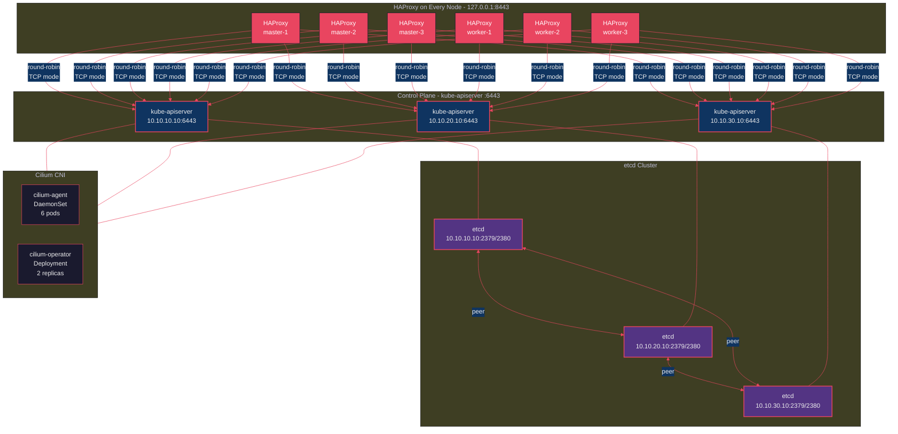
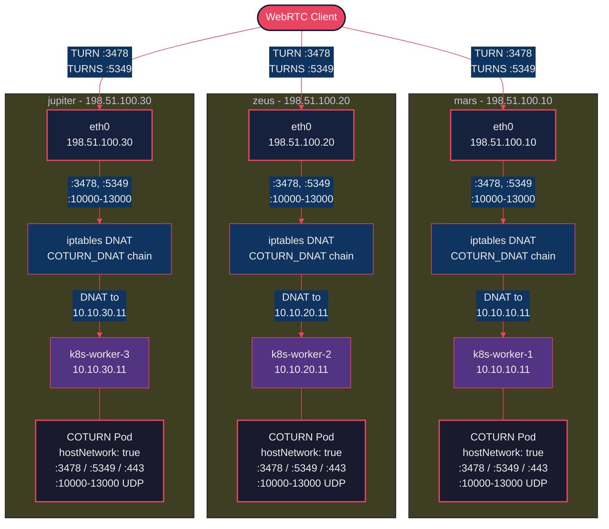
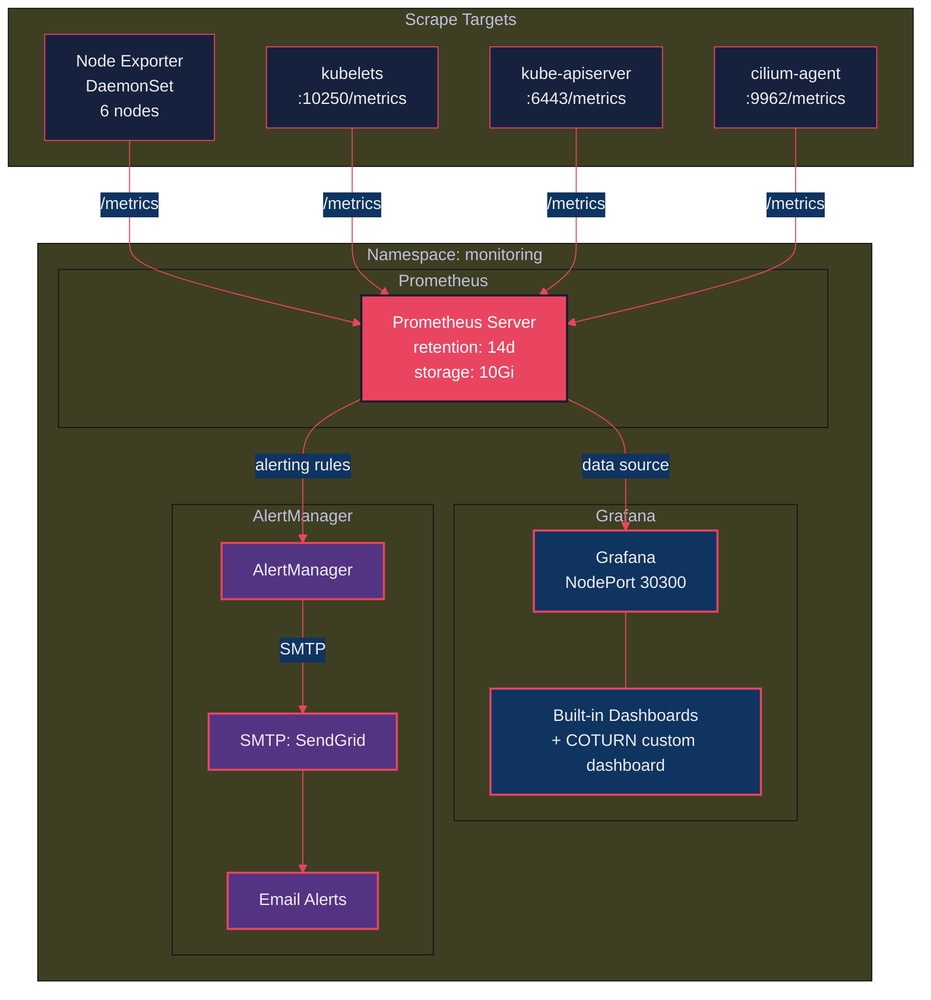

# From One Box to Three: Building a Multi-Host HA Kubernetes Cluster That Refuses to Die

*A guide on evolving from a single-server K8s setup to a 3-host, 6-VM, WireGuard-meshed, Cilium-powered, battle-hardened cluster — with COTURN on every host, because WebRTC users deserve nice things.*

---

So, remember that blog post where I crammed an entire Kubernetes cluster into one Hetzner box? Three VMs, one master, two workers, COTURN, the works? It was beautiful. It ran like a charm. My apps were humming. My dashboards were green.

And then I thought: "What happens when mars goes down?"

*Silence.*

That single Hetzner box — affectionately named `mars` — was a single point of failure. If it sneezed, everything sneezed with it. The master node, the workers, COTURN, the whole circus. One kernel panic, one disk failure, one Hetzner maintenance window, and my users would be staring at a loading spinner.

So I did what any reasonable person with a taste for self-inflicted complexity would do: I got two more servers. Named them `zeus` and `jupiter`. Because if you're going to over-engineer something, at least give the servers cool names.

Spoiler alert: it was totally worth it. Again.

---

# The Upgrade: What Changed

Let me lay it out. The old setup vs. the new one:

| | **Old (single-host)** | **New (multi-host HA)** |
|---|---|---|
| **Servers** | 1 (mars) | 3 (mars, zeus, jupiter) |
| **VMs** | 3 (1 master + 2 workers) | 6 (3 masters + 3 workers) |
| **Control plane** | Single master (SPOF) | HA with 3 masters + etcd quorum |
| **Networking** | Single NAT bridge | WireGuard mesh + 3 NAT bridges |
| **COTURN** | 2 pods (1 host, 2 public IPs) | 3 pods (3 hosts, 3 public IPs) |
| **Failover** | None. Pray. | Automatic. etcd quorum, HAProxy LB |
| **Total resources** | 10 vCPU, 20 GB RAM | 34 vCPU, 248 GB RAM |
| **Deployment phases** | 10 | 15 |

The old cluster was a studio apartment. The new one is a three-bedroom house with a panic room.

# Part 1: The Architecture (a.k.a. "How Many Diagrams Can One Blog Post Have?")

## Physical Topology

Three Hetzner dedicated servers, spread across their Frankfurt datacenter. Each runs KVM with two VMs — one master, one worker. Connected by a WireGuard mesh that makes them think they're neighbors.



Three hosts. Six VMs. One cluster. Zero single points of failure. Well, except for my own sanity — that had exactly one replica with no failover.

## The Network Layer Cake

Here's where it gets fun. We have *four* layers of networking, stacked like a particularly ambitious lasagna:



From top to bottom:

1. **Public IPs** — how the internet sees us (3 Hetzner IPs)
2. **WireGuard mesh** — how the hosts see each other (encrypted tunnel, `10.10.0.0/24`)
3. **VM subnets** — how VMs talk within their host (`10.10.{10,20,30}.0/24`)
4. **K8s overlay** — how pods talk to each other (Cilium VXLAN, `10.244.0.0/16`)

The MTU math is important here: Ethernet 1500 → WireGuard overhead → 1420 → VXLAN overhead → **1370**. Get this wrong and you'll spend three days debugging why large packets silently disappear. Ask me how I know.

---

# Part 2: WireGuard — The Glue That Holds It Together

The fundamental challenge of a multi-host cluster is: *how do VMs on different physical servers talk to each other?* Your master on mars needs to gossip with the master on jupiter. Your pods need to float freely across all six VMs.

Enter WireGuard. It's a VPN. It's fast. It's simple. It's built into the Linux kernel. And it turns three servers in the same datacenter into what feels like one big happy network.



Each host peers with the other two (full mesh). The `AllowedIPs` include both the WireGuard IP *and* the remote VM subnet — so mars can route to `10.10.20.0/24` (zeus's VMs) and `10.10.30.0/24` (jupiter's VMs) through the tunnel.

The PostUp scripts handle the routing magic:

```bash
# mars PostUp adds:
ip route add 10.10.20.0/24 via 10.10.0.2 dev wg0   # route to zeus VMs
ip route add 10.10.30.0/24 via 10.10.0.3 dev wg0   # route to jupiter VMs
```

There's also an anti-masquerade dance with iptables to preserve source IPs across the mesh. Without it, all cross-host traffic looks like it comes from the WireGuard gateway, which confuses... well, everything.

<details>
<summary><strong>Deep Dive: The Anti-Masquerade Problem</strong></summary>

libvirt helpfully adds MASQUERADE rules to NAT traffic from VMs to the outside. Great for internet access. Terrible for cross-host VM communication — because it rewrites the source IP to the host's WireGuard address, breaking things like etcd peer discovery and Cilium health checks.

The fix: mark WireGuard-bound packets and skip masquerading for them:

```bash
iptables -t mangle -A POSTROUTING -o wg0 -j MARK --set-mark 0x1
iptables -t nat -A POSTROUTING -m mark --mark 0x1 -j RETURN
```

This tells the kernel: "If a packet is heading out wg0, mark it. If it's marked, don't masquerade it." The VMs keep their real source IPs, and the world makes sense again.

</details>

---

# Part 3: HA Control Plane — No More Single Points of Failure

The old setup had one master. One API server. One etcd. If it went down, `kubectl` became a very fancy error generator.

The new setup? Three masters, three etcd members, and — here's the punchline — **HAProxy on every single node**.



**Why HAProxy on every node?** Because every kubelet needs to talk to the API server. If we pointed them all at one master, we're back to SPOF territory. Instead, every VM runs HAProxy on `127.0.0.1:8443`, round-robining across all three API servers. Kubelet talks to localhost, HAProxy handles the rest.

If one master dies, the other two keep serving. etcd maintains quorum (2 out of 3). kube-scheduler and kube-controller-manager have leader election built in. The cluster barely notices.

<details>
<summary><strong>Deep Dive: The kubeadm Bootstrap Dance</strong></summary>

Bootstrapping an HA cluster with kubeadm is... a carefully choreographed dance:

1. **master-1**: `kubeadm init --control-plane-endpoint=127.0.0.1:8443 --upload-certs`
2. Install Cilium (with `operator.replicas=1` — only one schedulable node at this point!)
3. **master-2 & master-3**: `kubeadm join` with `--control-plane` flag
4. Scale Cilium operator to 2 replicas (now there are multiple nodes)
5. **worker-1, 2, 3**: Regular `kubeadm join`
6. Label workers with roles, topology zones, and `coturn=true`

The critical detail: `skipPhases: addon/kube-proxy` in the kubeadm config. Cilium replaces kube-proxy entirely. Installing both is asking for a networking fight that nobody wins.

Also, we use `kubeadm.k8s.io/v1beta4` for K8s 1.31. If you're following an old tutorial with `v1beta3`, you'll get mysterious YAML validation errors. Fun times.

</details>

---

# Part 4: COTURN — Now With Triple Redundancy

In the old setup, we had two COTURN pods sharing two public IPs on one host. Cute, but if that host went down, every WebRTC user behind a NAT would be staring at a black screen.

Now we have **three COTURN instances, one per host**, each with its own public IP and its own iptables forwarding chain:



Each host has its own `COTURN_DNAT` iptables chain that forwards TURN traffic (3478, 5349, 10000-13000) from the host's public IP to the worker VM. Each COTURN pod runs with `hostNetwork: true` and knows its own public/private IP mapping via the `external-ip` config.

The beautiful part: lose a host, lose one COTURN instance. The other two keep relaying. Your WebRTC users don't even notice.

<details>
<summary><strong>Deep Dive: The COTURN SNAT Gotcha</strong></summary>

Here's a fun one that cost me half a day. When a COTURN pod on worker-1 (10.10.10.11) needs to relay media to a client that came in through zeus (198.51.100.20), the relay packet exits through mars's WireGuard tunnel. But the client expects the reply to come from zeus's public IP, not mars's.

The fix: per-host SNAT rules that ensure outbound relay traffic from each worker gets rewritten to the correct public IP:

```bash
# On mars
iptables -t nat -A COTURN_SNAT -s 10.10.10.11 -p udp -m multiport --sports 10000:13000 -j SNAT --to-source 198.51.100.10
```

Without this, clients would see relay packets arriving from the wrong IP and silently drop them. WebRTC is very particular about where its packets come from. Can't blame it, really.

</details>

---

# Part 5: The 15-Phase Deployment Pipeline

The entire cluster bootstraps from zero through 15 Ansible phases. It's like a recipe, except instead of ending with a cake, you end up with a production-grade Kubernetes cluster.

```mermaid
%%{init: {'theme': 'base', 'themeVariables': {'primaryColor': '#1a1a2e', 'primaryTextColor': '#eee', 'lineColor': '#e94560', 'secondaryColor': '#0f3460'}}}%%
flowchart TD
    P0["Phase 0: Teardown Old<br/>Remove previous cluster"]
    P1["Phase 1: Host Bootstrap<br/>Create user, install packages"]
    P2["Phase 2: Generate SSH Keys<br/>Per-host ed25519 keys"]
    P3["Phase 3: Host Setup<br/>KVM, libvirt, bridge network"]
    P4["Phase 4: WireGuard Mesh<br/>wg0 on 3 hosts, routing"]
    P5["Phase 5: VM Provisioning<br/>Cloud-init, qcow2, virt-install"]
    P6["Phase 6: HAProxy<br/>127.0.0.1:8443 on every node"]
    P7["Phase 7: K8s Prerequisites<br/>containerd, kubeadm, kubelet"]
    P8["Phase 8: K8s Masters<br/>kubeadm init + join, Cilium"]
    P9["Phase 9: K8s Workers<br/>kubeadm join workers"]
    P10["Phase 10: COTURN Deploy<br/>3 COTURN pods, TLS certs"]
    P11["Phase 11: Host Networking<br/>iptables DNAT + SNAT + SNI"]
    P12["Phase 12: Host kubectl<br/>kubectl + HAProxy on hosts"]
    P13["Phase 13: Monitoring<br/>kube-prometheus-stack"]
    P14["Phase 14: Verify<br/>Health checks"]

    P0 --> P1 --> P2 --> P3 --> P4 --> P5 --> P6 --> P7 --> P8 --> P9 --> P10 --> P11 --> P12 --> P13 --> P14

    classDef teardownStyle fill:#e94560,stroke:#1a1a2e,stroke-width:2px,color:#fff
    classDef hostStyle fill:#16213e,stroke:#e94560,stroke-width:2px,color:#eee
    classDef wgStyle fill:#0f3460,stroke:#e94560,stroke-width:2px,color:#eee
    classDef vmStyle fill:#533483,stroke:#e94560,stroke-width:2px,color:#eee
    classDef k8sStyle fill:#1a1a2e,stroke:#e94560,stroke-width:2px,color:#eee
    classDef appStyle fill:#0f3460,stroke:#533483,stroke-width:2px,color:#eee
    classDef verifyStyle fill:#16213e,stroke:#533483,stroke-width:2px,color:#eee

    class P0 teardownStyle
    class P1,P2,P3 hostStyle
    class P4 wgStyle
    class P5 vmStyle
    class P6,P7 k8sStyle
    class P8,P9 k8sStyle
    class P10,P11 appStyle
    class P12 hostStyle
    class P13 appStyle
    class P14 verifyStyle
```



Running it is almost anticlimactic:

```bash
git clone https://github.com/your-user/k8s-cluster-multi.git
cd k8s-cluster-multi
cp .env.example .env && vi .env    # add your secrets
make setup                          # go make a sandwich
make verify                         # confirm everything works
```

The `make verify` script runs 9 categories of health checks: VM connectivity, WireGuard mesh, cross-host routing, K8s node status, Cilium health, COTURN relay testing, iptables rules, monitoring stack, and DNS resolution. It's basically a 60-second anxiety reducer.

---

# Part 6: Monitoring — Dashboard Therapy

We deploy the full **kube-prometheus-stack** via Helm. Because running a 6-node cluster without monitoring is like driving at night with the headlights off. Technically possible. Highly inadvisable.



Access Grafana from your laptop:
```bash
make grafana-tunnel   # SSH tunnel → localhost:3000
```

Fourteen days of metric retention, email alerts via SendGrid, and a custom COTURN dashboard that shows relay allocations, bandwidth, and error rates. It's oddly soothing to watch those graphs. Dashboard therapy, I call it.

---

# Part 7: What's Actually Running on This Thing?

With a 6-node cluster and 248 GB of RAM, we're not just running COTURN. Here's the current tenant list:

| App | Stack | Worker | Domain |
|-----|-------|--------|--------|
| **App 1** | Rust (Axum) + Vue 3 + mediasoup WebRTC | worker-3 | app1.example.com |
| **App 2** | Bun/Elysia.js + Vue 3 | worker-1 | app2.example.com |
| **App 3** | Bun/Elysia.js + Vue 3 (8 microservices) | worker-2 | app3.example.com |
| **App 4** | Rust (Axum) + Vue 3 + ClickHouse | worker-2 | app4.example.com |
| **App 5** | 3 legacy apps + Redroid (Android in K8s!) | worker-3 | various |
| **COTURN** | 3 relay instances | all workers | coturn.example.com |
| **Monitoring** | Prometheus + Grafana + AlertManager | system | internal |

Twelve namespaces, running everything from a Rust WebRTC SFU to literal Android containers in Kubernetes. mars handles the nginx reverse proxy for all public domains. The workers handle the compute. The masters keep the peace.

---

# Lessons Learned (The Hard Way, Part 2)

Because apparently I didn't learn enough painful lessons the first time:

**1. containerd's `sandbox_image` will ruin your weekend.**
K8s 1.31 expects pause:3.10. containerd's default config ships with pause:3.8. This mismatch causes a pod sandbox recreation storm that manifests as random CrashLoopBackOffs with no obvious cause. The fix: regenerate the full containerd config and patch it. I now do this religiously.

**2. Cilium operator replicas during bootstrap.**
When you `kubeadm init` on master-1, there's only one schedulable node. If you install Cilium with `operator.replicas=2`, the second replica can't schedule, and Cilium enters a degraded state. Start with 1, scale to 2 after workers join.

**3. WireGuard + libvirt masquerading is a trap.**
libvirt's default NAT masquerade rewrites source IPs on cross-host traffic, breaking etcd peer communication, Cilium health checks, and your will to live. You need explicit anti-masquerade rules for WireGuard-bound packets.

**4. Network interface names are not universal.**
mars uses `eth0`. zeus and jupiter use `enp5s0`. Different Hetzner hardware generations, different names. Parametrize everything. Never hardcode an interface name.

**5. Docker restarts flush your iptables.**
If you run Docker on the bare-metal hosts (we do, for nginx), its restart hook flushes and recreates iptables chains — including your carefully crafted COTURN_DNAT rules. Solution: a systemd service that re-applies COTURN rules after Docker starts, plus an explicit Docker event hook. Belt and suspenders.

**6. COTURN SNAT + cross-host relay is non-obvious.**
When COTURN on worker-1 relays media to a client that connected via zeus's IP, the reply packet must be SNAT'd to zeus's public IP, not mars's. Without per-host SNAT rules for relay port ranges, clients silently drop packets because the source IP doesn't match. This one was a beautiful 4-hour debugging session.

---

# What's Next?

The cluster is stable, running five production apps, and I've only been woken up once by an alert (false alarm — Prometheus was just being dramatic).

On the roadmap:
- **Automated backups** — scheduled MongoDB dumps to S3/MinIO
- **GitOps** — ArgoCD for declarative deployments
- **Autoscaling** — HPA for the apps that need it
- **Multi-region** — because three servers in one datacenter is just distributed single-point-of-failure, if you squint hard enough

---

# Try It Yourself

The entire infrastructure is open source:

- **Multi-host HA cluster:** (this repo)
- **Original single-host setup:** (see companion single-host repo)

Star the repos if this was useful, open an issue if something's broken, and if you successfully build your own multi-host cluster after reading this — drop me a line. I'll raise a coffee to your success. Actually, make it a beer. You'll have earned it.

Cheers!
